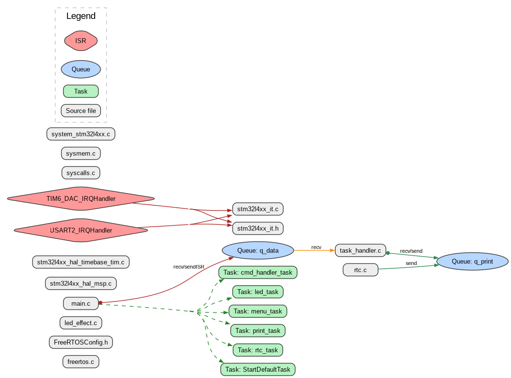

# STM32 FreeRTOS Interactive CLI & Hardware Controller

Projekt ten to interaktywny system menu działający z poziomu wiersza poleceń (CLI) przez interfejs UART, oparty na systemie czasu rzeczywistego **FreeRTOS** i mikrokontrolerze **STM32L476RG**. 

Program pozwala na asynchroniczne sterowanie efektami świetlnymi (LED) oraz konfigurację i monitorowanie sprzętowego zegara czasu rzeczywistego (RTC) bez blokowania pracy procesora.

## 🌟 Główne funkcje
* **Interaktywne Menu UART:** Asynchroniczna obsługa komend użytkownika.
* **Zarządzanie Zadaniami (Tasks):** Architektura oparta na 5 współpracujących zadaniach FreeRTOS.
* **Efekty LED (Software Timers):** 4 różne sekwencje migania diod LED sterowane za pomocą programowych timerów FreeRTOS.
* **Obsługa RTC:** Ustawianie czasu, daty oraz cykliczne raportowanie aktualnego czasu przez terminal.
* **Bezpieczny Output (Thread-safe Print):** Dedykowane zadanie do wysyłania danych przez UART, zapobiegające "mieszaniu się" tekstów z różnych zadań.

---

## 🏗️ Architektura Systemu i Komunikacja (FreeRTOS)

System został zaprojektowany w oparciu o natywne API FreeRTOS (z pominięciem wrappera CMSIS-OS dla większej elastyczności). 



### 1. Zadania (Tasks)
W systemie działa 5 głównych wątków:
* `menu_task` (Główna maszyna stanów) - Odpowiada za wyświetlanie głównego menu i delegowanie pracy do innych zadań na podstawie wybranej opcji.
* `cmd_handler_task` (Parser komend) - Czeka na dane w kolejce wejściowej, ekstrahuje stringi, formatuje je w struktury `command_t` i powiadamia odpowiednie zadania o nowej komendzie.
* `print_task` (Strażnik UART TX) - Jedyne zadanie mające prawo pisać do UART. Czeka na wskaźniki do stringów w kolejce `q_print` i wysyła je w świat.
* `led_task` - Wyświetla sub-menu LED i zarządza efektami na podstawie odebranych komend.
* `rtc_task` - Obsługuje złożoną maszynę stanów do wprowadzania godzin, minut, sekund oraz daty, a także włącza/wyłącza raportowanie.

### 2. Mechanizmy IPC (Inter-Process Communication)

System opiera się na wydajnym przekazywaniu danych bez aktywnego czekania (non-blocking).


* **Kolejki (Queues):**
  * `q_data` (Input): Zbiera pojedyncze znaki (bajty) odbierane w przerwaniu UART (`HAL_UART_Receive_IT`).
  * `q_print` (Output): Przekazuje wskaźniki na ciągi znaków (stringi) z dowolnego zadania prosto do `print_task`.
* **Powiadomienia Zadań (Task Notifications):** Zamiast ciężkich semaforów, system używa `xTaskNotifyWait` i `xTaskNotify` do synchronizacji (np. `menu_task` budzi `led_task` i czeka, aż tamto skończy pracę). Zmienna stanowa `curr_state` określa, do kogo trafiają komendy.
* **Timery Programowe (Software Timers):**
  * `handle_led_timer[4]`: 4 timery odpowiedzialne za bezkontaktowe (non-blocking) przełączanie stanów diod LED (efekty 1-4).
  * `rtc_timer`: Odpala się co 1000 ms, wysyłając aktualny czas na terminal, jeśli raportowanie jest włączone.

---

## 🚀 Jak działa przepływ danych (Data Flow)

1. Użytkownik wpisuje znak w terminalu (np. PuTTY).
2. Generowane jest przerwanie UART (Hardware).
3. Przerwanie wrzuca znak do kolejki `q_data`.
4. Po wykryciu znaku nowej linii (`\n`), `cmd_handler_task` budzi się, pobiera całą komendę z kolejki i pakuje ją w strukturę.
5. Na podstawie globalnej zmiennej `curr_state`, `cmd_handler_task` wysyła powiadomienie z wpisaną komendą do odpowiedniego zadania (np. `rtc_task`).
6. Docelowe zadanie przetwarza dane, wykonuje akcję sprzętową i wysyła odpowiedź tekstową do `print_task` przez kolejkę `q_print`.

---

## 🛠️ Wymagania Sprzętowe
* **Płytka:** STM32 Nucleo-L476RG (lub podobna z serii L4).
* **Zegar Systemowy:** Zegary skonfigurowane dla LSI/MSI. Przerwanie systemowe FreeRTOS (Tick) podpięte pod wolny timer sprzętowy (np. `TIM6`), aby nie kolidowało z biblioteką HAL (`SysTick`).
* **Zewnętrzne komponenty:** 4 Diody LED podłączone do pinów:
  * `PA8` (LED1)
  * `PA9` (LED2)
  * `PA10` (LED3)
  * `PA11` (LED4)
* **Połączenie PC:** UART2 (TX: PA2, RX: PA3) z prędkością 115200 bps, 8N1.

---

## ⚙️ Instrukcja Budowania (Build & Flash)
1. Sklonuj repozytorium.
2. Otwórz projekt w **STM32CubeIDE** lub użyj dostarczonego pliku **Makefile** (`make all`).
3. Upewnij się, że pliki `task_handler.c` oraz `led_effect.c` są uwzględnione w procesie budowania (nie są wykluczone z kompilacji).
4. Wgraj program na mikrokontroler (np. przez ST-Link / OpenOCD).
5. Otwórz terminal portu szeregowego (PuTTY, TeraTerm) ustawiony na `115200 baud`.

---

## 📝 Użytkowanie (CLI)
Po zresetowaniu płytki w terminalu pojawi się główne menu:
```text
========================
|         Menu         |
========================
LED effect    ----> 0
Date and time ----> 1
Exit          ----> 2
Enter your choice here :

Aby uruchomić efekt LED: Wpisz 0, naciśnij Enter, a następnie wybierz efekt wpisując e1, e2, e3 lub e4. Aby wyłączyć, wpisz none.

Aby skonfigurować zegar: Wpisz 1, naciśnij Enter, a następnie podążaj za instrukcjami na ekranie, aby ustawić godzinę i datę. Możesz też włączyć raportowanie w tle (opcja 2 w sub-menu RTC).